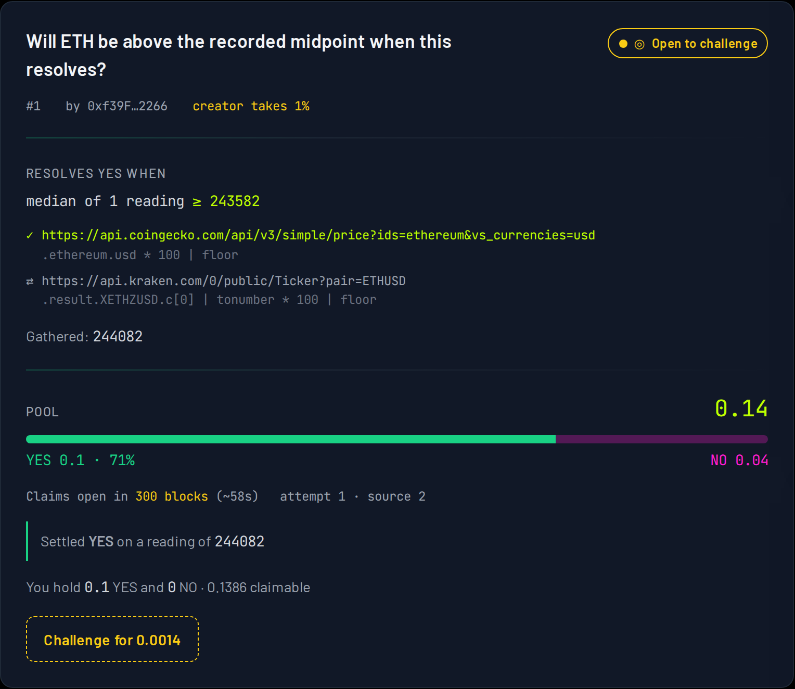

# Ritual Predict

[](https://github.com/Takatabro926/ritual-chain-workshop-2/actions/workflows/ci.yml)

A self-resolving binary prediction market on [Ritual Chain](https://docs.ritualfoundation.org).

Ask a question like *"Will ETH clear $2,420 when this market resolves?"*, stake native
RITUAL on YES or NO, and watch it settle itself. When the betting window closes **nobody
presses a resolve button and no backend cron job runs**. The Ritual Scheduler wakes the
contract at a block fixed when the market was created; the contract reads its oracles
through the HTTP precompile, narrows each answer to one number with jq, takes the median,
and settles. Winners pull their share of the pool.



Everything on that card is live state: two sources declared, the first already read, the
number it returned, the outcome that follows from it, the creator's cut already deducted
from what is claimable, and the bond a challenger would have to post.

---

## Ritual Chain was down for all of this

`rpc`, `explorer` and `faucet` all resolve to one host that never completes a TCP
connection, while the documentation host answers in a fifth of a second — so this is one
unreachable service, not DNS and not something at this end. Checked, not assumed, and
checkable by anyone: `cd hardhat && node scripts/probe-chain.ts`, with the reading and
what it rules out in [`docs/CHAIN-STATUS.md`](docs/CHAIN-STATUS.md).

**Nothing here has been deployed on chain.** No address, no transaction hash, and no
observed value that came back from a TEE executor — the faucet is on the same dead host,
so even a working RPC would have left the deployer unfunded.

What exists instead:

- the contract running against a local `hardhat node` with stand-ins installed at the
  canonical precompile and system-contract addresses;
- oracle behaviour replayed from responses **recorded from live endpoints**, narrowed by
  the real `jq` binary — the numbers are real even though the chain is not;
- a frontend that runs against that node, and a demo mode that runs against the recordings
  with no chain at all;
- [screenshots of the app driving a whole market](docs/screenshots/), generated by a script
  rather than assembled by hand.

Where a claim cannot be checked locally, this repository says so rather than implying
otherwise. See [`AUDIT.md`](AUDIT.md).

---

## What this fork adds

The workshop ships a skeleton: five function bodies read `// we'll fill this up`.
Implementing them is the first half of the work; the rest is below.

| | |
|---|---|
| **The five unwritten functions** | `createMarket`, `_scheduleResolution`, `_pickExecutor`, `_readOracle`, `onScheduledResolve` — one commit each |
| **[E1 — resolution by quorum](EXTENSIONS.md#e1--resolution-by-quorum)** | Up to five sources, a required number of readings, settled on their median |
| **[E2 — the creator's cut](EXTENSIONS.md#e2--the-creators-cut)** | A bounded fee, charged only on a market that resolved |
| **[E3 — a challenge window](EXTENSIONS.md#e3--a-challenge-window)** | A bonded challenger can buy a second reading |
| **[E4 — positions as ERC-721](EXTENSIONS.md#e4--positions-as-erc-721)** | A bet is a token; moving it moves the stake |
| **[13 audit findings](AUDIT.md)** | Six fixed, the rest recorded with reasons — including three defects that stopped a clean checkout from working |
| **A frontend** | Next.js and wagmi, with a demo mode that needs no chain |
| **85 tests, 100% coverage** | Line and statement, on both contracts |

---

## Architecture

```
                 createMarket()                    ┌──────────────────────────┐
   user  ─────────────────────────────────────────▶│  RitualPredict.sol       │
   user  ─────────── bet(id, YES|NO) ─────────────▶│                          │
                                                   │  markets, pools, stakes  │
                                     schedule() ◀──┤  positions (ERC-721)     │
                                                   └──────────────────────────┘
    ┌─────────────────────────────┐                     ▲              │
    │ Scheduler  0x56e7…D58B      │  onScheduledResolve │              │ deposit()
    │ system contract             │─────────────────────┘              ▼
    │ fires at resolveBlock,      │                        ┌────────────────────────┐
    │ sources × 3 attempts,       │                        │ RitualWallet 0x532F…   │
    │ 200 blocks apart            │                        │ prepaid execution fees │
    └─────────────────────────────┘                        └────────────────────────┘
                     one source per wake-up, inside that transaction:

   TEEServiceRegistry 0x9644…  ──pickServiceByCapability(HTTP_CALL)──▶  executor address
   HTTP precompile    0x0801   ──GET oracles[cursor].url (in a TEE)──▶  that venue
   jq  precompile     0x0803   ──jsonPath, outputType=uint256───────▶  one reading
                                          │
                    readings < quorum  ───┴──▶  wait for the next wake-up
                    readings ≥ quorum      ──▶  median ⋈ target → Resolved(YES|NO)
                                                └─▶ challenge window, then claims
                    sources exhausted      ──▶  Invalid (everyone refunds)
```

---

## Design decisions worth knowing

**Deadlines are block numbers, not timestamps.** The Scheduler fires at a *block*, so
betting also closes at a *block*. "Betting is closed" and "the Scheduler woke us" can then
never disagree, whatever the chain's block time does. `createMarket` takes human durations
in seconds and converts them using the `blockTimeMs` fixed at deployment. Nothing on chain
reads `block.timestamp`.

**On Ritual Chain, `block.timestamp` is Unix milliseconds** (≈`1.786e12`), not seconds —
verified against the live chain by the workshop author, not assumed. Good reason to avoid
it entirely, which this contract does.

**A quorum is gathered across executions, not inside one.** A short-running async
precompile may be called **once per transaction**, so three venues cannot be polled in a
single callback. Each scheduled wake-up reads one source; a source that answers advances
the cursor, and one that fails is retried until its own attempts run out and is then
abandoned, so a dead endpoint cannot consume the whole budget. The booking is sized for
the worst case, `sources × MAX_ATTEMPTS` executions.

**The median, never an average.** An average produces a number no source reported. The
market's whole claim is that it settled against something an oracle actually returned, so
`_median` returns a real reading; with an even count, the upper of the two middles.

**A failed oracle read is never a NO.** A precompile failure, a non-200, an undecodable
envelope, an executor error message, an unsettled async output and an unparseable body are
all *misses*. The response decode happens through an external `try`, so malformed bytes
surface as a caught failure instead of reverting the execution and rolling back the attempt
counter. Eight distinct misses are tested; every one leaves the market unresolved.

**Payouts are pull-based and loop-free.** `claimWinnings` computes one claimant's share of
`pool − fee + bounty` and nothing else. Integer division truncates once per claimant, so
the pool can lose at most **one wei per winner** — measured, not assumed: a 4 ETH pool with
two winners leaves exactly 1 wei behind, and the bound is asserted in the suite.

**Empty winning side → refundable.** Pari-mutuel has no denominator when nobody backed the
winning answer, so the market records the outcome and the reading, then becomes `Invalid`
so everyone takes their stake back.

**A resolved market is not final at once.** For 300 blocks nobody can claim and anyone may
post a bond worth 1% of the pool to force a second reading. The second reading stands
either way; a challenger who was right takes the bond back, one who was wrong forfeits it
into the pool. There is no third reading.

**Resolution parameters are immutable.** `target`, `comparator`, `quorum`, every
`oracles[i]`, `feeBps` and `resolveBlock` have no setter. `ResolutionRuleSet` and one
`OracleSource` per source record them at creation.

**No executor is hardcoded.** The contract asks
`TEEServiceRegistry.pickServiceByCapability(HTTP_CALL, true, seed, 8)` at resolution time,
seeded with the market, the attempt, the block and its own address, so each retry probes a
different slot.

---

## Running it

```bash
cd hardhat
pnpm install
npx hardhat compile
npx hardhat test nodejs --coverage      # 85 tests, 100% on both contracts
node scripts/contract-size.ts --check   # EIP-170, on a plain build
```

Nothing deploys on a bare node — the constructor calls `approveScheduler` at an address
with no code — so the stand-ins go in first:

```bash
npx hardhat node                                                   # terminal one
npx hardhat run scripts/setup-local-chain.ts --network localhost   # terminal two
npx hardhat run scripts/verify-lifecycle.ts --network localhost    # what CI runs
```

Then the frontend, which prints nothing to configure if you leave the address unset — it
runs in demo mode:

```bash
cd web && pnpm install && pnpm dev
```

See [`web/README.md`](web/README.md) for demo mode, the design tokens, and deployment.

---

## Evidence

| | |
|---|---|
| Tests | 85, `hardhat/test/` — TypeScript, viem, `node:test` |
| Coverage | **100.00%** line and statement on `RitualPredict.sol` and `PositionToken.sol` |
| Contract size | 20,245 bytes against EIP-170's 24,576 |
| Oracle fixtures | 7 responses recorded from live endpoints, `jq 1.8.2` |
| CI | compile, size, coverage, frontend build, and a full market driven on a real node |

## Where to look

| | |
|---|---|
| [`ROADMAP.md`](ROADMAP.md) | What was planned, written before any code |
| [`AUDIT.md`](AUDIT.md) | 13 findings, each marked fixed, scheduled or noted |
| [`EXTENSIONS.md`](EXTENSIONS.md) | The four extensions and what each changed for readers |
| [`docs/CHAIN-STATUS.md`](docs/CHAIN-STATUS.md) | Whether the chain is up, and how to check it yourself |
| [`docs/screenshots/`](docs/screenshots/) | The app driving a market, and what those pictures are not |
| [`web/README.md`](web/README.md) | The frontend, demo mode, and the design system |

## Scope

Intentionally not included: an AMM, an order book, an order-matching engine, governance, a
separate ERC-20, a centralized resolver, or an upgrade proxy. Staking uses the chain's
native asset and the betting model is plain pari-mutuel.

## Reference

- Ritual Chain docs — <https://docs.ritualfoundation.org>
- dApp skills — <https://github.com/ritual-foundation/ritual-dapp-skills>
- Explorer — <https://explorer.ritualfoundation.org> · Faucet — <https://faucet.ritualfoundation.org>
